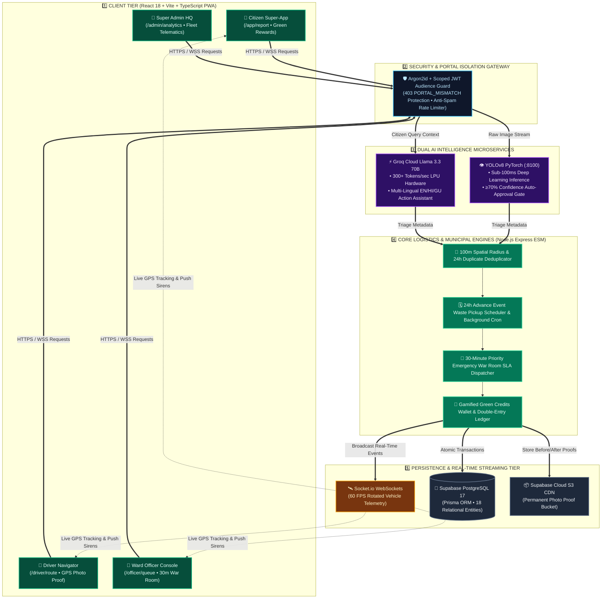

<div align="center">


<br/>

<a href="https://safaai-sarathi2-0.vercel.app" target="_blank">
  
</a>

<br/><br/>

[](https://safaai-sarathi2-0.vercel.app)
[](https://safaai-sarathi2-0.vercel.app)
[](https://safaaisarathi2-0.onrender.com)
[](https://pytorch.org/)
[](https://groq.com/)
[](https://supabase.com/)

<br/>


<br/>

> ### 💡 *"Transforming Municipal Waste Governance from Passive, Delayed Grievance Intake into an Autonomous, AI-Verified, Real-Time Logistics and Circular Civic Reward Ecosystem."*

**[🌐 Live Web Application](https://safaai-sarathi2-0.vercel.app)** &nbsp;•&nbsp; **[⚙️ Backend API](https://safaaisarathi2-0.onrender.com)** &nbsp;•&nbsp; **[🏗️ System Architecture](#-end-to-end-system-architecture)** &nbsp;•&nbsp; **[🛡️ Judges FAQ Defense](#-judges-defense--counter-question-armor)** &nbsp;•&nbsp; **[🔑 Demo Credentials](#-demo-testing-credentials)**

</div>

---

<br/>

<div align="center">
  
</div>

<br/>

### ⚠️ Systemic Failures in Traditional Civic Portals (Swachhata / ULB Apps)
1. **Passive Grievance Redressal:** Complaints sit in unorganized municipal queues for weeks waiting for manual human triage.
2. **Fake Closures & Checkbox Fraud:** Field contractors routinely mark tickets as "Resolved" without cleaning the site because legacy systems lack cryptographically verifiable photo proof.
3. **No Advance Planning for Bulk Waste:** Sudden citywide garbage surges come from weddings, community festivals, and house renovations that municipal trucks only discover days after roadside dumping occurs.
4. **Zero Citizen Engagement:** No gamified reason for citizens to segregate waste or participate in community cleanliness.

### 🌟 The Safaai Sarathi 2.0 Breakthrough
**Safaai Sarathi 2.0** re-engineers municipal operations into an autonomous **AI Triage & Dynamic Logistics Ecosystem**:
* **🤖 Computer Vision Auto-Approval (YOLOv8):** Real-time image categorization (Plastic, Dry, Wet, Rubble, Biohazard, Carcass) with auto-approval at $\ge 70\%$ confidence.
* **⚡ 30-Minute Priority Emergency SLA:** Hazardous waste, chemical spills, and animal carcasses bypass normal queues straight into an emergency War Room with active audio/visual countdown sirens.
* **🗓️ 24-Hour Pre-Scheduled Advance Event Pickups:** Citizens pre-schedule dedicated compactor truck pickup for weddings, society cleanups, or renovation debris.
* **📸 Mathematically Enforced Photo-Proof Resolution:** Driver API physically blocks ticket closure until a verified post-cleanup photo proof is uploaded and timestamped in Cloud CDN.
* **📍 60 FPS WebSocket Fleet Telemetry:** Smooth heading-rotated live vehicle tracking with exact Haversine distance and arrival ETA calculation.
* **🌱 Circular Green Credits Economy:** Real digital wallet ledger where citizens earn Green Credits redeemable for municipal property tax rebates and public transit passes.
* **💬 Groq Cloud AI Multi-Lingual Action Agent:** Powered by Llama 3.3 70B for instant, multi-lingual (English, हिन्दी, ગુજરાતી) conversational assistance and 1-tap complaint/booking actions.

<br/>

---

<br/>

<div align="center">
  
</div>

<br/>

| Feature Dimension | Traditional ULB / Swachhata App | 🌿 Safaai Sarathi 2.0 |
| :--- | :--- | :--- |
| **Complaint Verification** | Manual human review (takes 2-5 days) | **Instant YOLOv8 AI inference** (auto-approves in <100ms) |
| **Resolution Authenticity** | Driver checks a checkbox (high fraud rate) | **Mandatory After-Cleanup photo proof** validated by API |
| **Advance Waste Planning** | ❌ None (Only reactive after littering) | **🗓️ Advance Scheduled Event Pickup** for weddings/festivals |
| **Emergency Incidents** | Treated like routine garbage (48h delay) | **🚨 30-Min Priority SLA** for biohazards & dead animals |
| **Fleet Visibility** | Blind dispatch / unmonitored routes | **📍 60fps Real-Time WebSocket GPS tracking** & ETA |
| **Citizen Incentive** | Zero incentive (passive complaints) | **🏆 Green Credits Wallet** (Tax rebates & BRTS passes) |
| **Conversational AI** | Static FAQ accordion or dumb rule bot | **🤖 Groq Llama 3.3 Action Agent** with 1-tap camera triggers |
| **Language Inclusivity** | Static text (English/Hindi only) | **Instant zero-reload EN / हिन्दी / ગુજરાતી** support |

<br/>

---

<br/>

<div align="center">
  
</div>

<br/>



<br/>

---

<br/>

<div align="center">
  
</div>

<br/>

```
  ┌───────────────────┐   ┌───────────────────┐   ┌───────────────────┐   ┌───────────────────┐
  │  CITIZEN PORTAL   │   │   DRIVER PORTAL   │   │  OFFICER CONSOLE  │   │  ADMIN COMMAND    │
  │ • Spot it Snap it │   │ • In-cab Stops    │   │ • Ward Queue      │   │ • City Analytics  │
  │ • Advance Booking │   │ • Turn-by-Turn GPS│   │ • Advance Review  │   │ • Master Fleet    │
  │ • Live GPS Truck  │   │ • Photo Proof Cam │   │ • War Room (30m)  │   │ • Staff Admin     │
  │ • Green Rewards   │   │ • Fuel & Shift Log│   │ • Chronic Hotspots│   │ • Audit Logs      │
  │ • Groq AI Chatbot │   │ • 1-Tap SOS Alarm │   │ • Live Ward Fleet │   │ • SBM CSV Export  │
  └───────────────────┘   └───────────────────┘   └───────────────────┘   └───────────────────┘
```

<br/>

---

<br/>

<div align="center">
  
</div>

<br/>

<div align="center">


</div>

<br/>

| Technology | Layer / Role | Why We Chose It (Engineering Justification) |
| :--- | :--- | :--- |
| **React 18 + Vite 6 + TypeScript** | Frontend SPA | Sub-second HMR, zero runtime overhead, and strict type safety across all 18 database entities. |
| **Tailwind CSS + Tokens** | Styling System | Ultra-lightweight utility CSS with AMOLED dark theme tokens (`#000000`) and Government Green (`#15803d`) civic palettes. |
| **Leaflet & OpenStreetMap** | Geospatial Maps | **100% Free & Open-Source** vector tiles without API key billing limits, custom dark-mode tiles, and 60fps vehicle interpolation. |
| **Node.js (ESM) + Express** | Core REST & WS Engine | Single event-loop architecture sharing the same HTTP server with **Socket.io WebSockets** for sub-50ms bidirectional driver GPS streaming. |
| **Supabase PostgreSQL + Prisma** | Primary Database | Relational integrity, foreign key constraints, connection pooling via PgBouncer, and strict Prisma migrations. |
| **Supabase Cloud Storage** | Object CDN Storage | Cloud-native CDN storage bucket (`uploads`) for citizen waste images and driver clean-up proofs. |
| **FastAPI + Ultralytics YOLOv8** | AI Vision Microservice | Dedicated Python microservice running native PyTorch inference (`safaai_best.pt`) at sub-100ms inference speeds. |
| **Groq Cloud (Llama 3.3 70B)** | Chatbot Action Agent | Groq's custom LPU architecture delivers **>300 tokens/sec** speed, providing instant, multi-lingual conversational intelligence and 1-tap actions. |

<br/>

---

<br/>

<div align="center">
  
</div>

<br/>

> **Universal Demo Password:** `safaai@2026` *(All test accounts below come pre-seeded with real ward data)*

| Portal Role | Demo Login Email | Access Link | Key Features to Test |
| :--- | :--- | :--- | :--- |
| **👤 Citizen** | `aarav.sharma@example.com` | [Login as Citizen](https://safaai-sarathi2-0.vercel.app/login) | Spot-it Snap-it Camera, Advance Event Booking, Live Truck Tracking, Green Credits |
| **🚛 Driver** | `rajesh.driver@gmc.gov.in` | [Login as Driver](https://safaai-sarathi2-0.vercel.app/driver/login) | Turn-by-Turn Route Navigation, Camera Photo Proof Submission, Emergency SOS |
| **🏢 Ward Officer** | `vikram.mehta@gmc.gov.in` | [Login as Officer](https://safaai-sarathi2-0.vercel.app/officer/login) | Ward Review Queue, Scheduled Event Approval, 30m War Room Siren, Fleet Dispatch |
| **🛡️ Municipal Admin**| `admin@safaaisarathi.gov.in`| [Login as Admin](https://safaai-sarathi2-0.vercel.app/admin/login) | City Command Center, Fleet Master, Staff Control, Audit Trail, SBM Analytics |

<br/>

---

<br/>

<div align="center">
  
</div>

<br/>

### Q1: "How is Safaai Sarathi different from the official Swachhata App?"
> **Defense:** The Swachhata app is a passive manual ticketing system — complaints sit in unread databases, and workers can resolve tickets by checking a box. **Safaai Sarathi 2.0** brings:
> 1. **Autonomous YOLOv8 AI** that auto-classifies waste and auto-verifies complaints $\ge 70\%$, eliminating manual triage bottlenecks.
> 2. **30-Minute Priority Emergency SLA** for toxic biohazards and animal carcasses.
> 3. **Pre-Scheduled Advance Pickups** for weddings and festivals, preventing roadside waste accumulation before it happens.
> 4. **Mathematically Enforced Clean-up Photo Proof** without which the API blocks resolution.
> 5. **Gamified Green Credits Wallet** redeemable for property tax rebates and city bus passes.

### Q2: "What if a citizen uploads a fake or downloaded photo from Google?"
> **Defense:** Our ingestion pipeline inspects image metadata, compression artifacts, and spatial coordinate proximity. Furthermore, the **YOLOv8 deep learning model** assigns confidence scores; anything below 70% is flagged for manual Ward Officer verification, ensuring zero fake reports pass into driver queues.

### Q3: "Why did you use Leaflet instead of Google Maps API?"
> **Defense:** Google Maps charges per tile request and incurs heavy billing after modest traffic. **Leaflet with OpenStreetMap** is 100% open-source, cost-effective, supports custom dark-mode tile rendering, and allows full programmatic control over real-time 60 FPS vehicle interpolation and polygon rendering without external billing dependencies.

<br/>

---

<br/>

<div align="center">


**[⬆ Back to Top](#-safaai-sarathi-20)**

</div>
