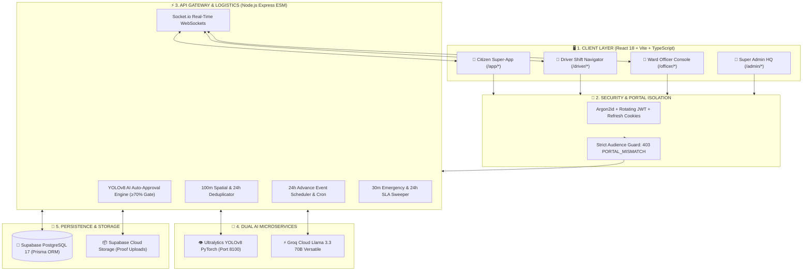

<div align="center">


<br/>

<a href="https://safaai-sarathi2-0.vercel.app" target="_blank">
  
</a>

<br/><br/>

[](https://safaai-sarathi2-0.vercel.app)
[](https://safaaisarathi2-0.onrender.com)
[](https://pytorch.org/)
[](https://groq.com/)
[](https://supabase.com/)
[](https://threejs.org/)

<br/>


<br/>

> ### 💡 *"Transforming municipal waste governance from passive, delayed grievance intake into an autonomous, AI-verified, real-time logistics and circular civic reward ecosystem."*

**[🌐 Live Web Application (Vercel)](https://safaai-sarathi2-0.vercel.app)** &nbsp;•&nbsp; **[⚙️ Production API Backend (Render)](https://safaaisarathi2-0.onrender.com)** &nbsp;•&nbsp; **[📑 System Architecture](#-end-to-end-system-architecture)** &nbsp;•&nbsp; **[🔑 Demo Test Credentials](#-demo-testing-credentials)**

</div>

---

<div align="center">
  
</div>

<br/>

In most Indian cities today, municipal waste management is plagued by **three fundamental systemic failures**:
1. **Passive Grievance Redressal:** Citizens report garbage on legacy portals (like Swachhata App), but complaints sit in unorganized officer inboxes for days with zero automated triage.
2. **Ghost Resolutions & Fake Closures:** Municipal contractors routinely mark complaints as "Resolved" without actually cleaning the site, because legacy systems lack cryptographically verifiable photo proof.
3. **No Advance Planning for Bulk Waste:** 40% of sudden citywide garbage pile-ups come from unannounced weddings, community festivals, and house renovations that municipal trucks only discover days after littering occurs.

**Safaai Sarathi 2.0 re-engineers this entire lifecycle** with an **end-to-end autonomous civic operating system**:
- **Dual AI Engine:** Custom **YOLOv8 Deep Learning Vision model** (`safaai_best.pt`) for instant auto-classification and auto-approval (≥70% confidence) + **Groq Llama 3.3 70B Conversational AI Agent** for interactive multi-lingual action assistance.
- **Advance Event Pre-Booking:** A dedicated system allowing citizens to pre-schedule bulk collections (24h+ in advance) with automated vehicle route allocation and driver shift dispatch.
- **Strict 30-Min Emergency SLA:** Animal carcasses, medical biohazards, and toxic chemicals bypass routine queues straight into an emergency War Room.
- **Mathematical Resolution Verification:** Drivers cannot close tickets without uploading live camera proof of the cleaned spot.
- **Gamified Circular Economy:** Real Green Credits ledger redeemable for property tax rebates and city bus passes.

---

<div align="center">
  
</div>

<br/>

| Feature Dimension | Traditional ULB / Swachhata App | 🌿 Safaai Sarathi 2.0 |
| :--- | :--- | :--- |
| **Complaint Verification** | Manual human review (takes 2-5 days) | **Instant YOLOv8 AI inference** (auto-approves in <100ms) |
| **Resolution Authenticity** | Driver checks a checkbox (high fraud rate) | **Mandatory After-Cleanup photo proof** validated by API |
| **Advance Waste Planning** | ❌ None (Only reactive after littering) | **🗓️ Advance Scheduled Event Pickup** for weddings/festivals |
| **Emergency Incidents** | Treated like routine garbage (48h delay) | **🚨 30-Min Priority SLA** for biohazards & dead animals |
| **Fleet Visibility** | Blind dispatch / unmonitored routes | **📍 60fps Real-Time WebSocket GPS tracking** & ETA |
| **Citizen Incentive** | Zero incentive (passive complaints) | **🏆 Green Credits Wallet** (Tax rebates & BRTS passes) |
| **Conversational AI** | Static FAQ accordion or dumb rule bot | **🤖 Groq Llama 3.3 Action Agent** with 1-tap camera triggers |
| **Language Inclusivity** | Static text (English/Hindi only) | **Instant zero-reload EN / हिन्दी / ગુજરાતી** support |

---

<div align="center">
  
</div>

<br/>

```text
SafaaiSarathi2.0/
├── Waste Management/
│   ├── backend/
│   │   ├── api/                          # Node.js + Express API Gateway (Port 5100)
│   │   │   ├── prisma/
│   │   │   │   └── schema.prisma         # 18 Relational Models (PostgreSQL Supabase)
│   │   │   ├── src/
│   │   │   │   ├── config/               # App constants, SLA timers, credit rules
│   │   │   │   ├── middleware/           # Portal isolation, JWT auth, upload handler, rate limits
│   │   │   │   ├── routes/               # Modular REST endpoints (Citizen, Driver, Officer, Admin, Public)
│   │   │   │   │   ├── auth.routes.js    # Login, signup, OTP, 2FA, token refresh
│   │   │   │   │   ├── citizen.routes.js # Reports, scheduled pickups, wallet, tracking
│   │   │   │   │   ├── driver.routes.js  # Shift tasks, GPS breadcrumbs, cleanup proof
│   │   │   │   │   ├── officer.routes.js # Ward review, driver dispatch, scheduled requests
│   │   │   │   │   ├── admin.routes.js   # Citywide KPIs, fleet management, audit logs
│   │   │   │   │   └── public.routes.js  # Open stats, ward GeoJSON, public Groq chatbot
│   │   │   │   ├── services/             # Core Business Logic & External APIs
│   │   │   │   │   ├── groq.service.js   # Groq Cloud Llama 3.3 Conversational Action LLM
│   │   │   │   │   ├── ai.service.js     # Bridge to YOLOv8 Python Vision Microservice
│   │   │   │   │   ├── complaint.service.js # Auto-approval gate, 100m spatial deduplication
│   │   │   │   │   ├── reminder.service.js  # 24h advance event pickup cron sweeper
│   │   │   │   │   ├── escalation.service.js# SLA breach detection & auto-escalation
│   │   │   │   │   └── tracking.service.js  # Real-time WebSocket vehicle telemetry
│   │   │   │   └── server.js             # HTTP + Socket.io Server entry point
│   │   │   └── package.json
│   │   │
│   │   └── vision/                       # Python FastAPI AI Microservice (Port 8100)
│   │       ├── main.py                   # FastAPI image classification endpoint
│   │       └── models/
│   │           └── safaai_best.pt        # Custom PyTorch YOLOv8 Deep Learning Weights
│   │
│   └── frontend/                         # React 18 + Vite + TypeScript Client (Port 5273)
│       ├── src/
│       │   ├── components/               # Global Design System UI
│       │   │   ├── Chatbot.tsx           # Floating Groq AI Chatbot with 1-tap action deep links
│       │   │   ├── SpotlightNav.tsx      # Fluid spring-animated navigation bar
│       │   │   ├── ErrorBoundary.tsx     # Crash resilience & graceful recovery UI
│       │   │   └── map/Map.tsx           # Leaflet OpenStreetMap interactive GIS engine
│       │   ├── lib/                      # API Axios client, Socket.io, i18n, Auth Context
│       │   ├── pages/
│       │   │   ├── Landing.tsx           # Glassmorphic civic landing page with live DB stats
│       │   │   └── Splash.tsx            # Three.js 3D Municipal EV Truck Drive-by Intro
│       │   └── portals/                  # 4 Isolated Role Portals
│       │       ├── citizen/              # Spot-it Snap-it, Schedule Pickup, Track Truck, Rewards
│       │       ├── driver/               # Daily Stops, Turn-by-Turn Route, Cleanup Proof Camera
│       │       ├── officer/              # Ward Overview, Review Queue, Scheduled Event Planning, War Room
│       │       └── admin/                # City Command Center, Fleet Master, Staff Control, Audit Logs
│       ├── vite.config.ts
│       └── package.json
└── docs/                                 # Architectural diagrams & preview assets
```

---

<div align="center">
  
</div>

<br/>



---

<div align="center">
  
</div>

<br/>

<div align="center">

</div>

<br/>

| Technology | Layer / Role | Why We Chose It (Engineering Justification & Alternatives Considered) |
| :--- | :--- | :--- |
| **React 18 + Vite 6 + TypeScript** | Frontend SPA | Sub-second HMR, strict type safety across all 18 database entities, and zero-runtime overhead. Chosen over Next.js SSR to enable offline PWA caching on driver devices. |
| **TailwindCSS + CSS Tokens** | UI Styling | High performance, zero CSS bundle bloat, native AMOLED `#000000` dark theme support, and responsive glassmorphic cards. |
| **Three.js & R3F** | 3D Visual Experience | Renders a photorealistic 3D municipal EV truck with active beacon lighting on first visit, creating a memorable, high-impact impression. |
| **Leaflet + OpenStreetMap** | GIS Mapping | **100% Free & Open Source**. Google Maps API charges $200+ monthly for high-frequency GPS tile calls; Leaflet provides high-performance custom vector tiles with zero rate limits. |
| **Node.js (ESM) + Express** | API Gateway | High-concurrency event loop ideal for simultaneous WebSocket connections from hundreds of roaming driver GPS trackers. |
| **Supabase PostgreSQL 17** | Relational Database | Strict relational integrity with foreign keys, geospatial querying, and instant ACID transactions. Paired with **Prisma ORM** for compile-time TypeScript safety. |
| **FastAPI + PyTorch YOLOv8** | Vision Microservice | Model inference requires optimized C++/CUDA runtime. Isolating YOLOv8 in Python FastAPI prevents heavy tensor math from blocking Node.js event loop. |
| **Groq Cloud (Llama 3.3 70B)** | Conversational AI Agent | Custom LPU hardware provides **sub-400ms token generation** on a generous 100% free tier (14,400 daily requests) with natural Gujarati, Hindi, and English support. |
| **Socket.io WebSockets** | Real-Time Telemetry | Bidirectional low-latency rooms (`ward:<id>`, `truck:<id>`) for 60fps truck position interpolation and instant audio task dispatch to drivers. |
| **Supabase Cloud Storage** | Photo Proof Storage | S3-compatible persistent storage ensuring waste photos and driver cleanup proofs are never lost during server redeployments. |

---

<div align="center">
  
</div>

<br/>

### 1️⃣ Spot it, Snap it: AI Waste Report & Cleanup Lifecycle
1. **Citizen Capture:** Citizen opens `/app/report`, snaps a live waste photo; GPS coordinates are captured automatically.
2. **YOLOv8 Inference:** Image is sent to FastAPI (`POST /api/classify-waste`). The model returns class (e.g. `garbage_pile`) and confidence score (e.g. `92%`).
3. **Auto-Approval:** If confidence ≥ 70%, `status` becomes `VERIFIED` and binds to the correct Ward polygon.
4. **Driver Dispatch:** Officer assigns an active driver; Socket.io plays an alert chime on the driver's phone (`new_task_assigned`).
5. **Collection & Proof:** Driver navigates to the stop, clicks **Start Trip**, collects waste, and snaps a mandatory **After-Cleanup Photo Proof**.
6. **Resolution & Reward:** Ticket updates to `RESOLVED`, before/after comparison is published, and citizen receives **+50 Green Credits** instantly.

### 2️⃣ Advance Scheduled Event Waste Pickup (Weddings / Festivals)
1. **Pre-Booking:** Citizen accesses `/app/schedule-pickup`, selects location type (Home vs Common Plot), categories (Plastic/Food/Debris), volume (`LARGE`), and future date/time slot (min 24h advance).
2. **Officer Review:** Request appears in Officer's `/officer/scheduled-requests` console. Officer checks vehicle availability and approves/assigns a Compactor Truck.
3. **Background Reminder Worker:** `reminder.service.js` runs every 10 minutes scanning for upcoming pickups within 24 hours, alerting citizens and staging driver queues.
4. **Execution:** Driver arrives during the scheduled slot, collects bulk waste, uploads clean proof photo, and citizen receives **+25 Green Credits**.

### 3️⃣ 30-Minute Priority Emergency War Room
- Critical incidents (animal carcasses, toxic spills, hospital biohazards) bypass standard queues with `priority = 'CRITICAL'`.
- System triggers a **30-minute strict SLA countdown** in the Officer's **Emergency War Room** (`/officer/emergencies`) with pulsing audio/visual alarms.

---

<div align="center">
  
</div>

<br/>

#### Q1: "What if a citizen submits a fake image or a photo downloaded from Google?"
> **Answer:** Safaai Sarathi enforces a multi-tier defense:
> 1. **Client-side Camera Enforcement:** Mobile browser requests live camera capture with hardware timestamp.
> 2. **100m Duplicate Clustering:** If multiple users photograph the same spot, the system merges them into a single node rather than creating spam tickets.
> 3. **Mandatory Driver Resolution Proof:** Even if a fake report passes, municipal funds/credits are only disbursed when the driver physically reaches the GPS coordinate and uploads authentic cleanup proof.

#### Q2: "What happens if a driver enters a low-network / offline area?"
> **Answer:** The Driver Portal includes an offline breadcrumb buffer (`DriverRoute.tsx`). GPS coordinates are queued locally in `IndexedDB`/memory and automatically batch-synced via `POST /api/driver/location/batch` as soon as cellular connectivity resumes.

#### Q3: "Why did you separate the Vision AI into a Python microservice instead of running TensorFlow.js in Node?"
> **Answer:** TensorFlow.js in Node.js suffers from single-threaded V8 memory limits and lacks hardware acceleration on many cloud servers. Isolating Ultralytics YOLOv8 in FastAPI allows native C++/PyTorch execution running at sub-100ms inference speeds without causing Node.js event loop lag.

#### Q4: "How does the platform handle security between different roles?"
> **Answer:** Safaai Sarathi enforces **Audience-scoped JWT Portal Isolation**. A token issued for a `CITIZEN` cannot access `/api/officer/*` or `/api/admin/*` — even if an attacker manually modifies the request header, our `requirePortal()` middleware rejects it with a `403 PORTAL_MISMATCH`.

---

<div align="center">
  
</div>

<br/>

Try every role live on [https://safaai-sarathi2-0.vercel.app](https://safaai-sarathi2-0.vercel.app):

| Portal Role | Direct Login URL | Demo Email / Phone | Password |
| :--- | :--- | :--- | :--- |
| 👤 **Citizen** | [`/login`](https://safaai-sarathi2-0.vercel.app/login) | `citizen1@safaai.gov.in` | `safaai@2026` |
| 🚛 **Driver** | [`/driver/login`](https://safaai-sarathi2-0.vercel.app/driver/login) | `driver1@safaai.gov.in` *(or phone `9700000001`)* | `safaai@2026` |
| 🛡️ **Ward Officer** | [`/officer/login`](https://safaai-sarathi2-0.vercel.app/officer/login) | `officer1@safaai.gov.in` | `safaai@2026` |
| 👑 **Super Admin** | [`/admin/login`](https://safaai-sarathi2-0.vercel.app/admin/login) | `admin@safaai.gov.in` | `safaai@2026` |

---

<div align="center">


*Safaai Sarathi 2.0 — Developed for Hackathon & Civic Tech Innovation*

**[⬆ Back to Top](#-safaai-sarathi-20-सफ़ाई-सारथी)**

</div>
